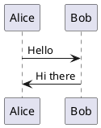

# Install PlantUML

## Overview
PlantUML is required for generating diagrams from `.puml` files in the documentation process. It's used by the `scripts/run_documentation.sh` script.

## Prerequisites
PlantUML requires Java to be installed on your system.

### Install Java (if not already installed)

**Linux:**
```bash
# Ubuntu/Debian
sudo apt update && sudo apt install default-jre

# Fedora/RHEL
sudo dnf install java-11-openjdk

# Arch Linux
sudo pacman -S jre-openjdk
```

**macOS:**
```bash
# Using Homebrew
brew install openjdk

# Or download from Oracle/OpenJDK websites
```

**Windows:**
- Download and install Java from [Oracle](https://www.oracle.com/java/technologies/downloads/) or [OpenJDK](https://openjdk.org/)
- Or use package managers like Chocolatey: `choco install openjdk`

## Install PlantUML

### Linux

**Ubuntu/Debian:**
```bash
sudo apt update
sudo apt install plantuml
```

**Fedora/RHEL/CentOS:**
```bash
sudo dnf install plantuml
```

**Arch Linux:**
```bash
sudo pacman -S plantuml
```

**openSUSE:**
```bash
sudo zypper install plantuml
```

### macOS

**Using Homebrew:**
```bash
brew install plantuml
```

**Using MacPorts:**
```bash
sudo port install plantuml
```

### Windows

**Using Chocolatey:**
```bash
choco install plantuml
```

**Using Scoop:**
```bash
scoop install plantuml
```

## Manual Installation (Alternative)

If package managers don't work, you can install PlantUML manually:

1. **Download PlantUML JAR:**
   ```bash
   # Download the latest plantuml.jar
   wget http://sourceforge.net/projects/plantuml/files/plantuml.jar/download -O plantuml.jar
   ```

2. **Create a wrapper script (Linux/macOS):**
   ```bash
   # Create plantuml script
   echo '#!/bin/bash' > plantuml
   echo 'java -jar /path/to/plantuml.jar "$@"' >> plantuml
   chmod +x plantuml
   sudo mv plantuml /usr/local/bin/
   ```

3. **Windows batch file:**
   ```batch
   @echo off
   java -jar C:\path\to\plantuml.jar %*
   ```

## Verify Installation

Test PlantUML installation:
```bash
plantuml -version
```

You should see PlantUML version information.

## Test with Sample Diagram

Create a test file `test.puml`:


Generate diagram:
```bash
plantuml -tsvg test.puml
```

This should create `test.svg` file.

## Usage in CyborgAI CLI

The `scripts/run_documentation.sh` script automatically:
1. Finds all `.puml` files in `documentation/data/`
2. Generates SVG diagrams using PlantUML
3. Includes them in the documentation

## Supported Output Formats

PlantUML supports various output formats:
- `-tsvg` - SVG (used by default in the project)
- `-tpng` - PNG
- `-tpdf` - PDF
- `-teps` - EPS
- `-tlatex` - LaTeX

## Troubleshooting

### Java Not Found
If you get "java command not found":
1. Install Java using the methods above
2. Ensure Java is in your PATH
3. Restart your terminal

### PlantUML Not Found
If you get "plantuml command not found":
1. Ensure PlantUML is installed
2. Check if it's in your PATH
3. Try using the full path to plantuml

### Permission Issues
On Linux/macOS, you might need `sudo` for installation commands.

### Memory Issues
For large diagrams, you might need to increase Java memory:
```bash
plantuml -Xmx1024m -tsvg diagram.puml
```

## Alternative: Online PlantUML

For quick testing, you can use the online PlantUML server:
- [PlantUML Online Server](http://www.plantuml.com/plantuml/uml/)

## Resources
- [PlantUML Official Website](https://plantuml.com/)
- [PlantUML Language Reference](https://plantuml.com/guide)
- [PlantUML Examples](https://real-world-plantuml.com/)